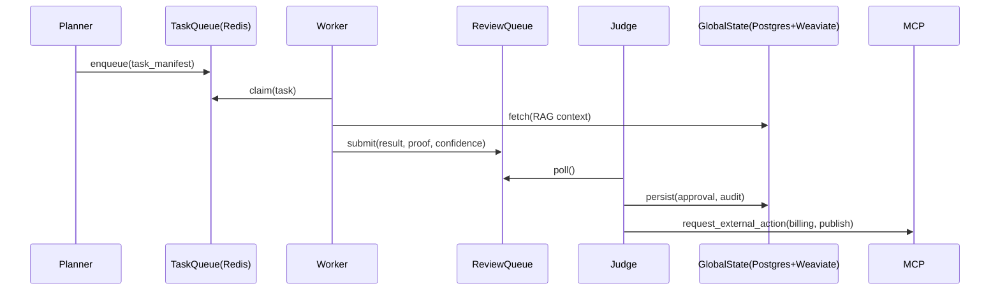
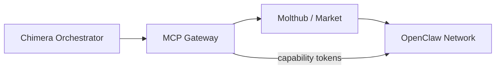

# Architecture Strategy – Project Chimera

## Plan for 1.2 (trace to SRS/readings)
- Provide a 2–3 paragraph executive summary tying business objectives to architectural choices, recommend the Hierarchical FastRender Swarm pattern with a detailed justification versus alternatives, describe HITL placement with numeric example thresholds tied to SRS NFRs, propose a hybrid datastore with exact responsibilities, include three mermaid diagrams, and list 8–10 future-proofing decisions mapped to SRS/readings.

## 1. Executive Summary
Project Chimera will deliver autonomous influencer agents that operate at scale while preserving safety, provenance, and economic accountability. We select a Hierarchical FastRender Swarm (Planner → Worker → Judge) orchestrated by a single Orchestrator and mediated by an MCP gateway (policy, billing, telemetry). This balances business needs (agentic commerce and marketplace participation), SRS constraints (FastRender, MCP, FR5), and lessons from the readings: a16z emphasizes environment adapters and telemetry to control opex; OpenClaw/MoltBook show the need for discovery plus governance.

## 2. Recommended Agent Pattern
Choice: Hierarchical Swarm (Planner → Worker → Judge).

Why this pattern:
- Aligns precisely with SRS §3.1 FastRender Swarm: Planner composes signed campaign manifests, Workers perform isolated, lease-based tasks, Judges adjudicate outputs (approve/retry/escalate) and emit audit events.
- Scalability & error recovery (NFR 3.0): stateless Workers enable massive horizontal scaling for many concurrent campaigns while Judges provide centralized policy enforcement to contain faults.
- Safety: Judges implement confidence-based gates and enforce provenance before external actions — reducing hallucination and drift compared with monolithic or ReAct approaches.

Why not alternatives:
- Sequential Chain / ReAct: suffers from linear throughput and brittle error propagation for multi-step commerce flows.
- Monolithic agents: concentrate privileges and escalate the blast radius of misbehavior; poor fit for HITL and financial pre-auth checks (FR5).

## 3. Human-in-the-Loop Placement & Safety Layer
HITL is implemented at the Judge with three configurable decision tiers (examples mapped to SRS NFR 1.0–1.2):
- Auto-approve: confidence ≥ 0.90 AND transaction amount ≤ microcredit (e.g., $1) — immediate external action.
- Fast-review (async human-in-loop): 0.70 ≤ confidence < 0.90 OR transaction between microcredit and moderate threshold (e.g., $1–$250) — sent to a prioritized review queue with 15–60 minute SLAs.
- Manual block: confidence < 0.70 OR flagged sensitive domain (legal/political/medical) — block and require manual sign-off before any external effect.

Judge responsibilities:
- Validate provenance & receipts, attach human review metadata, emit Tenx MCP Sense telemetry (trace_id, task_manifest_id, SOUL_id), and trigger rollback on post-approval anomalies.

## 4. Database & Storage Architecture
Recommendation: Hybrid architecture with explicit responsibilities:
- Semantic / Long-term memory: Weaviate (vector DB)
  - Stores persona embeddings, campaign context, and citations for RAG (FR2). Enables fast similarity search for grounding campaign content.
- Transactional data: PostgreSQL
  - Agent profiles, campaign manifests, ACLs, reputation indices, and append-only ledger tables (FR5). Use partitioning for scale and immutable write patterns for receipts.
- Episodic / Short-term cache & queues: Redis
  - Task queues (claim/lease), rate-limit counters, ephemeral worker state, leader-election keys.
- Financial ledger: Append-only tables in PostgreSQL + cryptographic receipts stored in S3-compatible object store; optional periodic anchoring to a permissioned ledger for higher tamper guarantees (FR5).
- Object storage: S3-compatible (MinIO dev) for media assets and large payloads.

Rationale: hybrid approach satisfies RAG & FR2 (Weaviate) while preserving ACID transactions and auditability for commerce (Postgres) and low-latency orchestration (Redis). It is cost-conscious and operationally pragmatic versus operating a full permissionless ledger immediately.

## 5. High-Level System Topology
Mermaid 1 — Orchestrator → Swarm → MCP Servers (hub-and-spoke)
```mermaid
flowchart LR
  Orchestrator[Orchestrator]
  subgraph MCPCluster[MCP Cluster (policy, billing, telemetry)]
    MCPG[MCP Gateway]
  end
  subgraph Swarm[FastRender Swarm]
    Planner[Planner]
    Workers[Worker Pool]
    Judge[Judge]
  end
  Orchestrator -->|registers/control| MCPG
  MCPG -->|capability grants| Planner
  Planner -->|task_manifest| Workers
  Workers -->|results/proofs| Judge
  Judge -->|approval| MCPG
  MCPG -->|marketplace| External[External Agents / Marketplaces]
```

Mermaid 2 — Internal FastRender loop (Planner → Queue → Worker → Review → Judge → Global State)


Mermaid 3 — Optional OpenClaw integration (discovery + Molthub)


## 6. Future-Proofing & Risk Mitigation
- MCP as the canonical API-adapter and policy layer to absorb external API volatility (SRS §3.2).
- Per-capability quotas, cost-center tags, and pre-authorization to prevent runaway opex (NFR 3.0 + a16z findings).
- Signed provenance (SOUL + Judge signatures) for all external artifacts to reduce hallucination and make external actions auditable (NFR & FR2).
- Append-only ledger with cryptographic receipts and optional periodic anchoring to permissioned ledger to improve tamper-resistance (FR5).
- Reputation decay & probation windows to limit long-lived abuse and gaming behaviors seen on MoltBook.
- Feature flags and staged rollouts for social-protocol changes to limit the blast radius.
- Rich telemetry: Tenx MCP Sense integration with schema-level tracing and PII retention rules.
- Autoscaling worker pools with liveness/readiness probes and automatic reconciliation for self-healing (NFR 3.0).

---
End of `research/architecture_strategy.md` — contains explicit decisions to be ratified into `specs/`.