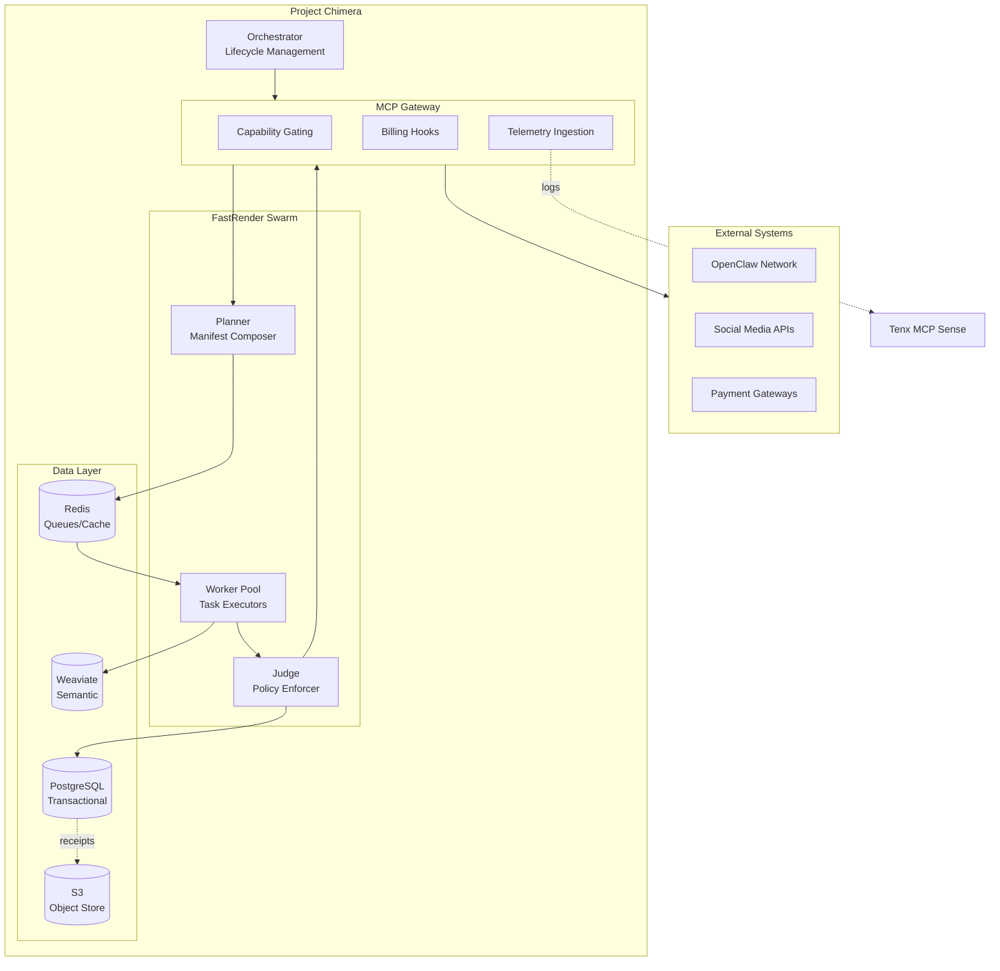
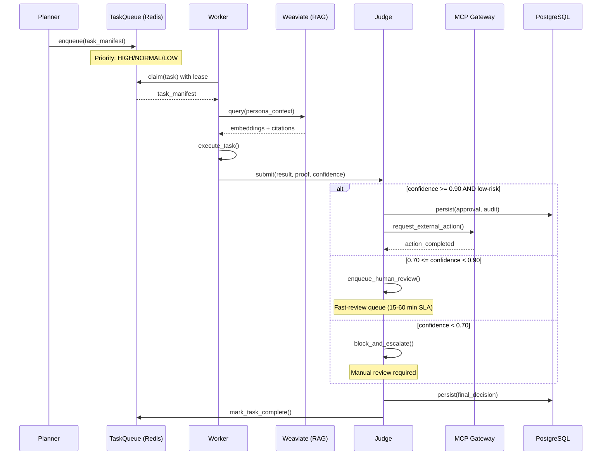
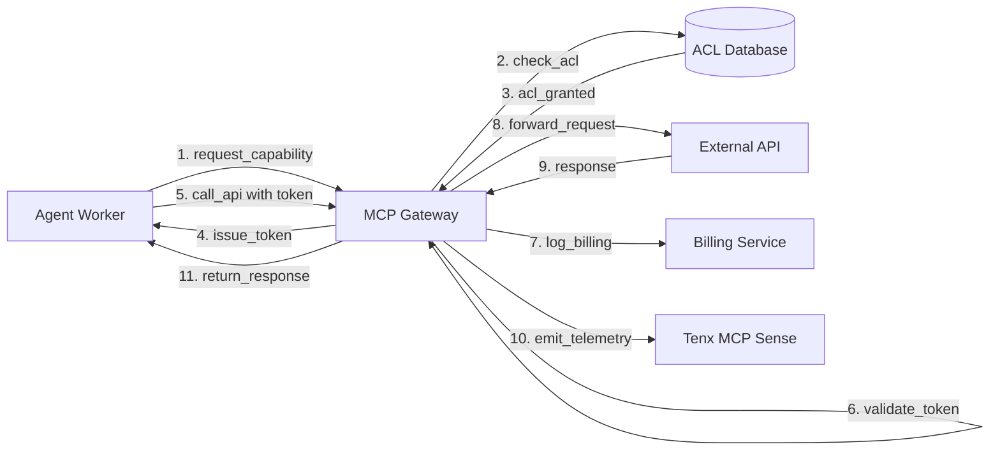

# Project Chimera — Technical Specification

## Overview

This document defines the technical contracts, schemas, and architecture for Project Chimera. It includes JSON schemas for Agent Tasks and MCP Tools (SRS Schema 1 & 2), database schema outline, and system architecture diagrams.

---

## 1. JSON Schema: Agent Task (SRS Schema 1)

### Task Manifest Schema

The Task Manifest is the core contract between Planner, Worker, and Judge in the FastRender Swarm.

```json
{
  "$schema": "http://json-schema.org/draft-07/schema#",
  "title": "AgentTaskManifest",
  "type": "object",
  "required": [
    "task_id",
    "campaign_id",
    "task_type",
    "created_at",
    "planner_soul_id",
    "payload",
    "dependencies",
    "timeout_seconds",
    "priority"
  ],
  "properties": {
    "task_id": {
      "type": "string",
      "format": "uuid",
      "description": "Globally unique task identifier"
    },
    "campaign_id": {
      "type": "string",
      "format": "uuid",
      "description": "Parent campaign identifier"
    },
    "task_type": {
      "type": "string",
      "enum": [
        "content_generation",
        "content_review",
        "social_publish",
        "analytics_fetch",
        "transaction_execute"
      ],
      "description": "Type of task to execute"
    },
    "created_at": {
      "type": "string",
      "format": "date-time",
      "description": "ISO 8601 timestamp of task creation"
    },
    "planner_soul_id": {
      "type": "string",
      "description": "SOUL ID of the planner agent that created this task"
    },
    "payload": {
      "type": "object",
      "description": "Task-specific input data",
      "properties": {
        "prompt": { "type": "string" },
        "context_ids": {
          "type": "array",
          "items": { "type": "string" }
        },
        "target_platform": { "type": "string" },
        "budget_limit": { "type": "number" }
      }
    },
    "dependencies": {
      "type": "array",
      "items": { "type": "string", "format": "uuid" },
      "description": "List of task_ids that must complete before this task"
    },
    "timeout_seconds": {
      "type": "integer",
      "minimum": 1,
      "maximum": 3600,
      "description": "Maximum execution time before task is considered failed"
    },
    "priority": {
      "type": "string",
      "enum": ["HIGH", "NORMAL", "LOW"],
      "default": "NORMAL"
    },
    "retry_policy": {
      "type": "object",
      "properties": {
        "max_attempts": { "type": "integer", "default": 3 },
        "backoff_multiplier": { "type": "number", "default": 2.0 }
      }
    }
  }
}
```

### Task Result Schema

```json
{
  "$schema": "http://json-schema.org/draft-07/schema#",
  "title": "AgentTaskResult",
  "type": "object",
  "required": [
    "task_id",
    "worker_soul_id",
    "status",
    "completed_at",
    "confidence",
    "output"
  ],
  "properties": {
    "task_id": {
      "type": "string",
      "format": "uuid"
    },
    "worker_soul_id": {
      "type": "string",
      "description": "SOUL ID of the worker that executed this task"
    },
    "status": {
      "type": "string",
      "enum": ["SUCCESS", "FAILED", "ESCALATED"],
      "description": "Task execution outcome"
    },
    "completed_at": {
      "type": "string",
      "format": "date-time"
    },
    "confidence": {
      "type": "number",
      "minimum": 0.0,
      "maximum": 1.0,
      "description": "Worker's confidence in the result quality"
    },
    "output": {
      "type": "object",
      "description": "Task-specific output data",
      "properties": {
        "content": { "type": "string" },
        "citations": {
          "type": "array",
          "items": {
            "type": "object",
            "properties": {
              "source_id": { "type": "string" },
              "similarity_score": { "type": "number" }
            }
          }
        },
        "generated_assets": {
          "type": "array",
          "items": { "type": "string", "format": "uri" }
        }
      }
    },
    "proof": {
      "type": "object",
      "description": "Evidence bundle for Judge review",
      "properties": {
        "execution_trace": { "type": "string" },
        "model_metadata": {
          "type": "object",
          "properties": {
            "model_name": { "type": "string" },
            "prompt_hash": { "type": "string" }
          }
        }
      }
    },
    "error": {
      "type": "object",
      "properties": {
        "error_code": { "type": "string" },
        "error_message": { "type": "string" },
        "stack_trace": { "type": "string" }
      }
    }
  }
}
```

---

## 2. JSON Schema: MCP Tool (SRS Schema 2)

### MCP Capability Definition

```json
{
  "$schema": "http://json-schema.org/draft-07/schema#",
  "title": "MCPCapability",
  "type": "object",
  "required": [
    "capability_id",
    "capability_name",
    "capability_type",
    "endpoint",
    "billing_config",
    "rate_limits"
  ],
  "properties": {
    "capability_id": {
      "type": "string",
      "format": "uuid"
    },
    "capability_name": {
      "type": "string",
      "examples": ["social_media_publish", "payment_gateway", "image_generation"]
    },
    "capability_type": {
      "type": "string",
      "enum": ["EXTERNAL_API", "INTERNAL_SERVICE", "COMPUTE_RESOURCE"]
    },
    "endpoint": {
      "type": "object",
      "properties": {
        "url": { "type": "string", "format": "uri" },
        "method": { "type": "string", "enum": ["GET", "POST", "PUT", "DELETE"] },
        "auth_type": { "type": "string", "enum": ["BEARER", "API_KEY", "OAUTH2"] }
      }
    },
    "billing_config": {
      "type": "object",
      "required": ["cost_per_call", "currency"],
      "properties": {
        "cost_per_call": { "type": "number", "minimum": 0 },
        "currency": { "type": "string", "default": "USD" },
        "cost_center_tag": { "type": "string" }
      }
    },
    "rate_limits": {
      "type": "object",
      "properties": {
        "calls_per_minute": { "type": "integer" },
        "calls_per_hour": { "type": "integer" },
        "calls_per_day": { "type": "integer" }
      }
    },
    "required_acls": {
      "type": "array",
      "items": { "type": "string" },
      "description": "List of ACL permissions required to use this capability"
    }
  }
}
```

### MCP Capability Token (Short-lived)

```json
{
  "$schema": "http://json-schema.org/draft-07/schema#",
  "title": "MCPCapabilityToken",
  "type": "object",
  "required": [
    "token_id",
    "capability_id",
    "granted_to_soul_id",
    "issued_at",
    "expires_at",
    "signature"
  ],
  "properties": {
    "token_id": {
      "type": "string",
      "format": "uuid"
    },
    "capability_id": {
      "type": "string",
      "format": "uuid"
    },
    "granted_to_soul_id": {
      "type": "string",
      "description": "SOUL ID of the agent granted this capability"
    },
    "issued_at": {
      "type": "string",
      "format": "date-time"
    },
    "expires_at": {
      "type": "string",
      "format": "date-time",
      "description": "Token TTL typically 5-15 minutes"
    },
    "allowed_operations": {
      "type": "array",
      "items": { "type": "string" },
      "description": "Specific operations allowed (e.g., ['publish', 'read_analytics'])"
    },
    "quota": {
      "type": "object",
      "properties": {
        "max_calls": { "type": "integer" },
        "max_spend": { "type": "number" }
      }
    },
    "signature": {
      "type": "string",
      "description": "ed25519 signature of token payload by MCP gateway"
    }
  }
}
```

---

## 3. Database Schema Outline

### PostgreSQL Tables

#### `campaigns`
Stores campaign metadata and state.

```sql
CREATE TABLE campaigns (
    campaign_id UUID PRIMARY KEY DEFAULT gen_random_uuid(),
    campaign_name VARCHAR(255) NOT NULL,
    owner_soul_id VARCHAR(255) NOT NULL,
    status VARCHAR(50) NOT NULL CHECK (status IN ('DRAFT', 'ACTIVE', 'PAUSED', 'COMPLETED', 'CANCELLED')),
    budget_total DECIMAL(10, 2),
    budget_spent DECIMAL(10, 2) DEFAULT 0.00,
    created_at TIMESTAMP WITH TIME ZONE DEFAULT NOW(),
    updated_at TIMESTAMP WITH TIME ZONE DEFAULT NOW(),
    metadata JSONB
);

CREATE INDEX idx_campaigns_owner ON campaigns(owner_soul_id);
CREATE INDEX idx_campaigns_status ON campaigns(status);
```

#### `agent_profiles`
Stores agent identity and configuration.

```sql
CREATE TABLE agent_profiles (
    soul_id VARCHAR(255) PRIMARY KEY,
    agent_name VARCHAR(255) NOT NULL,
    persona_schema_version VARCHAR(50),
    public_key TEXT NOT NULL,
    status VARCHAR(50) NOT NULL CHECK (status IN ('CREATED', 'ACTIVE', 'SUSPENDED', 'TERMINATED')),
    reputation_score DECIMAL(5, 2) DEFAULT 0.00,
    created_at TIMESTAMP WITH TIME ZONE DEFAULT NOW(),
    updated_at TIMESTAMP WITH TIME ZONE DEFAULT NOW(),
    persona_config JSONB
);

CREATE INDEX idx_agent_status ON agent_profiles(status);
```

#### `ledger`
Append-only transaction ledger.

```sql
CREATE TABLE ledger (
    tx_id UUID PRIMARY KEY DEFAULT gen_random_uuid(),
    from_soul_id VARCHAR(255),
    to_soul_id VARCHAR(255),
    amount DECIMAL(10, 2) NOT NULL,
    currency VARCHAR(10) DEFAULT 'USD',
    purpose VARCHAR(255),
    campaign_id UUID REFERENCES campaigns(campaign_id),
    receipt_hash VARCHAR(128) NOT NULL,
    created_at TIMESTAMP WITH TIME ZONE DEFAULT NOW(),
    metadata JSONB
);

-- Append-only: no UPDATE or DELETE allowed (enforced by triggers)
CREATE INDEX idx_ledger_from ON ledger(from_soul_id);
CREATE INDEX idx_ledger_to ON ledger(to_soul_id);
CREATE INDEX idx_ledger_campaign ON ledger(campaign_id);
```

#### `receipts`
Cryptographic receipt metadata (actual receipts in S3).

```sql
CREATE TABLE receipts (
    receipt_id UUID PRIMARY KEY DEFAULT gen_random_uuid(),
    tx_id UUID NOT NULL REFERENCES ledger(tx_id),
    receipt_hash VARCHAR(128) NOT NULL,
    s3_uri TEXT NOT NULL,
    signature TEXT NOT NULL,
    created_at TIMESTAMP WITH TIME ZONE DEFAULT NOW()
);

CREATE UNIQUE INDEX idx_receipts_tx ON receipts(tx_id);
```

#### `acls`
Access control lists for capability gating.

```sql
CREATE TABLE acls (
    acl_id UUID PRIMARY KEY DEFAULT gen_random_uuid(),
    soul_id VARCHAR(255) NOT NULL REFERENCES agent_profiles(soul_id),
    capability_id UUID NOT NULL,
    granted_at TIMESTAMP WITH TIME ZONE DEFAULT NOW(),
    expires_at TIMESTAMP WITH TIME ZONE,
    granted_by VARCHAR(255),
    revoked BOOLEAN DEFAULT FALSE
);

CREATE INDEX idx_acls_soul ON acls(soul_id);
CREATE INDEX idx_acls_capability ON acls(capability_id);
```

### Weaviate Collections

#### `persona_embeddings`
Stores persona profile embeddings for RAG.

```python
{
    "class": "PersonaEmbedding",
    "properties": [
        {"name": "soul_id", "dataType": ["string"]},
        {"name": "persona_name", "dataType": ["string"]},
        {"name": "voice_tone", "dataType": ["text"]},
        {"name": "content_themes", "dataType": ["text[]"]},
        {"name": "embedding_version", "dataType": ["string"]},
        {"name": "created_at", "dataType": ["date"]}
    ],
    "vectorizer": "text2vec-openai"
}
```

#### `campaign_context`
Stores campaign context and historical performance.

```python
{
    "class": "CampaignContext",
    "properties": [
        {"name": "campaign_id", "dataType": ["string"]},
        {"name": "campaign_description", "dataType": ["text"]},
        {"name": "target_audience", "dataType": ["text"]},
        {"name": "engagement_metrics", "dataType": ["object"]},
        {"name": "successful_patterns", "dataType": ["text[]"]},
        {"name": "created_at", "dataType": ["date"]}
    ],
    "vectorizer": "text2vec-openai"
}
```

#### `citations`
Stores citation sources for RAG retrieval.

```python
{
    "class": "Citation",
    "properties": [
        {"name": "source_id", "dataType": ["string"]},
        {"name": "source_type", "dataType": ["string"]},
        {"name": "content", "dataType": ["text"]},
        {"name": "url", "dataType": ["string"]},
        {"name": "author", "dataType": ["string"]},
        {"name": "published_at", "dataType": ["date"]}
    ],
    "vectorizer": "text2vec-openai"
}
```

### Redis Structures

#### Task Queues
```
# Priority queues (sorted sets with score = priority + timestamp)
ZADD task_queue:HIGH <score> <task_id>
ZADD task_queue:NORMAL <score> <task_id>
ZADD task_queue:LOW <score> <task_id>

# Task lease tracking (hash with TTL)
HSET task_lease:<task_id> worker_soul_id <soul_id>
EXPIRE task_lease:<task_id> 300  # 5 minute lease
```

#### Rate Limits
```
# Per-agent rate limit counters
INCR rate_limit:<soul_id>:<capability_id>:minute
EXPIRE rate_limit:<soul_id>:<capability_id>:minute 60

INCR rate_limit:<soul_id>:<capability_id>:hour
EXPIRE rate_limit:<soul_id>:<capability_id>:hour 3600
```

#### Worker State (Ephemeral)
```
# Worker heartbeat
HSET worker:<soul_id> status ACTIVE last_heartbeat <timestamp>
EXPIRE worker:<soul_id> 60
```

---

## 4. System Architecture Diagrams

### Diagram 1: High-Level System Topology



### Diagram 2: FastRender Loop Sequence



### Diagram 3: MCP Capability Flow



---

## 5. Technology Stack Details

### Core Services
- **Orchestrator**: FastAPI (Python 3.12+)
- **Planner**: Python service with LangChain for manifest composition
- **Worker Pool**: Celery workers with autoscaling
- **Judge**: Python service with rule engine + LLM-based review
- **MCP Gateway**: FastAPI with capability token validation

### Data Layer
- **PostgreSQL**: 14+ with partitioning for ledger tables
- **Weaviate**: 1.23+ with text2vec-openai vectorizer
- **Redis**: 7+ with Redis Streams for task queues
- **S3**: MinIO (dev), AWS S3 (prod)

### External Integrations
- **Tenx MCP Sense**: HTTP telemetry endpoint
- **OpenClaw**: REST API for discovery/matchmaking
- **LLM Providers**: OpenAI GPT-4, Anthropic Claude (via MCP)
- **Image Generation**: DALL-E 3, Stable Diffusion (via MCP)

---

**Document Status**: Draft v1.0  
**Owner**: Engineering Team  
**Last Updated**: 2026-02-06  
**Next Review**: After openclaw_integration.md completion
